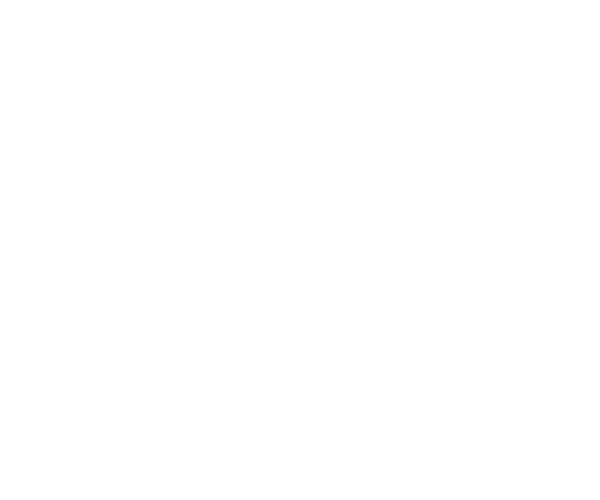
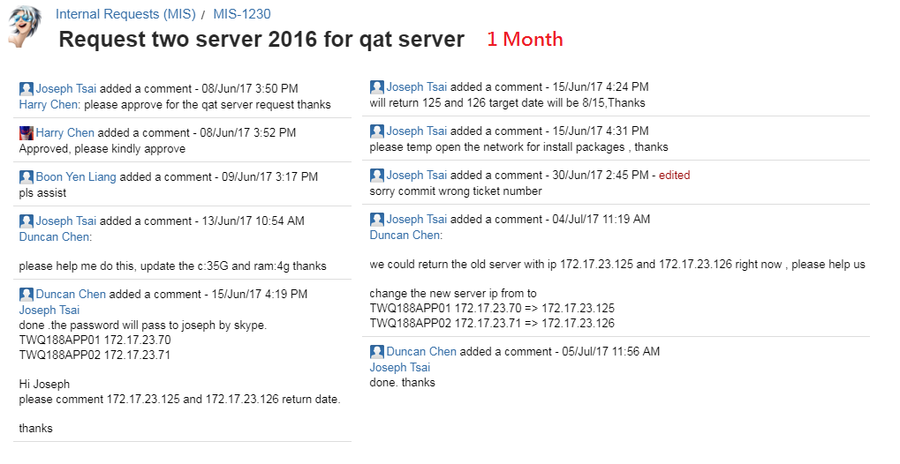
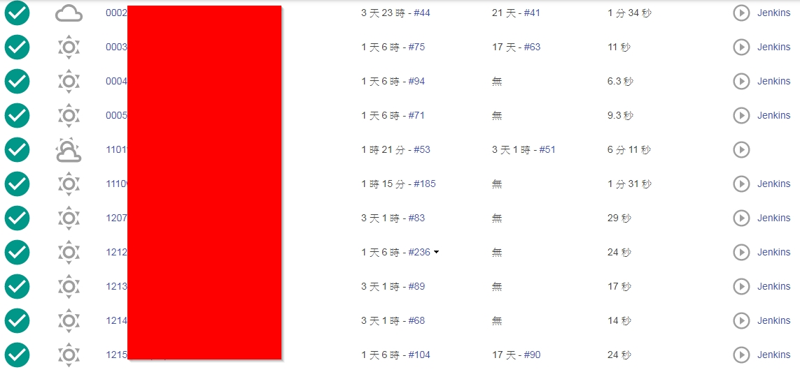
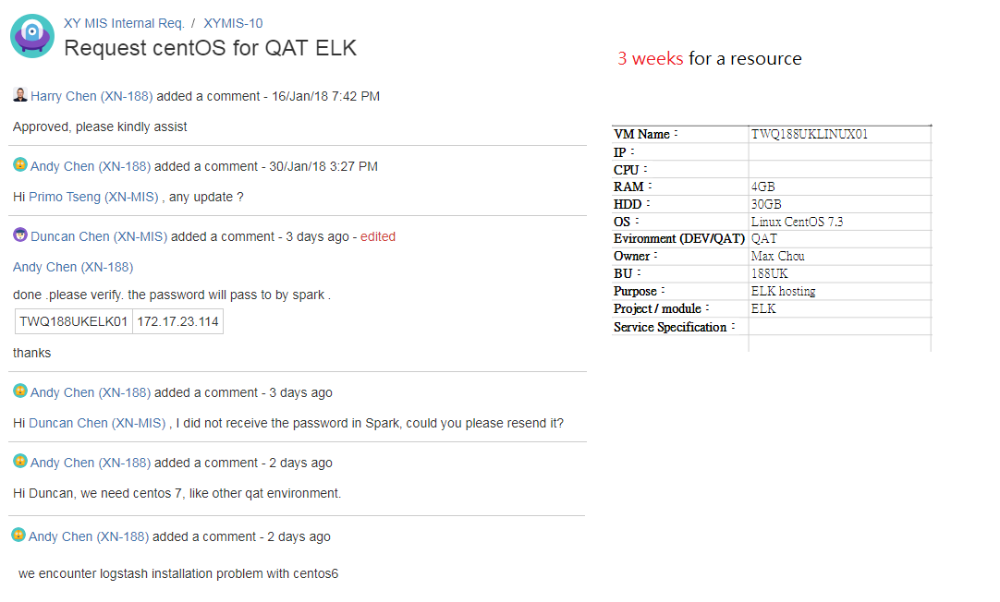
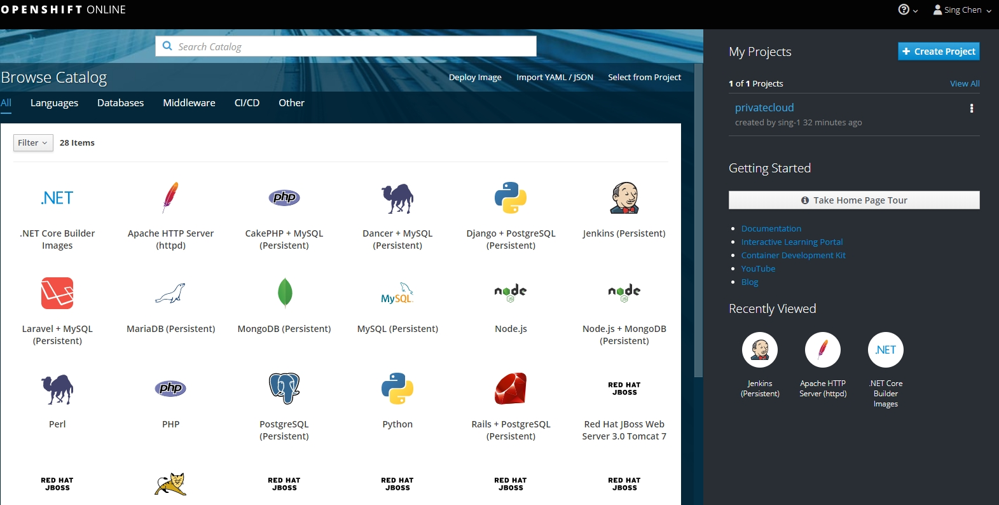

---

## Current challenge

1. Apply resource too slow
1. Unable to monitor all Server/Application
1. Can not build new environment from template

---

Apply resource too slow

Note:

- Slow for applying resource and adjust settings (memory, hardisk, OS version) - XYMIS-10 (3 weeks), MIS-1241 (5 days),  MIS-1230 (1 month)
  - too many processes (Finding document, inaccurate assessment, Approve flow, Server spec adjustment multiple times, firewall....)
  - Limited resource and free but unreleased resource lead to tight assessment and bargain. It caused more repeated flow

---

Unable to monitor all Server/Application

Note:

- Unable to know Server/Application status 
  - e.g. After QAT deployment required one by one manually check

===

---

Can not build new environment from template

Note:

- Difficult to build new environment - 1~2 day(s)
  - Apply new server required effort for finding last apply info and reinstall every software and settings
  - Although VM image template could achieve the same goal, MIS is unable to maintain all BU's image. By using private cloud IT could maintain their own image in version control

---

## Phases

1. Build a mini private cloud
    - ETA : 3 weeks
    - Require resource : 2 linux VM, 2 windows VM, Books, Courses

1. Shift small modules into private cloud
    - ETA : 1 week

1. Shift one team's QAT environment into private cloud
    - ETA : 1 month
    - Resolve Issue : Unable to know Server/Application status, Slow for applying resource and adjust settings
    - Require resource : Transfer team's QAT server resources into private cloud

1. Build CI/CD environment in private cloud with docker integration
    - ETA : 1 month
    - Resolve Issue : Difficult to build new environment
    - Require resource : Docker resource

1. Share experience to entire company, help teams shift QAT environment
    - ETA : 1 month
    - Require resource : Member from each team

---

---

## Expected outcome

1. Cost of server reduce 20%
2. Time of applying resource reduce 90%
3. Time of checking application/server reduce 90%
4. Duplicate same environment in 10 minutes

---

## Member

- Andy Chen
- Alex Wang
- Jamie Chien
- Max Chen
- Max Chou

---

# Thank you